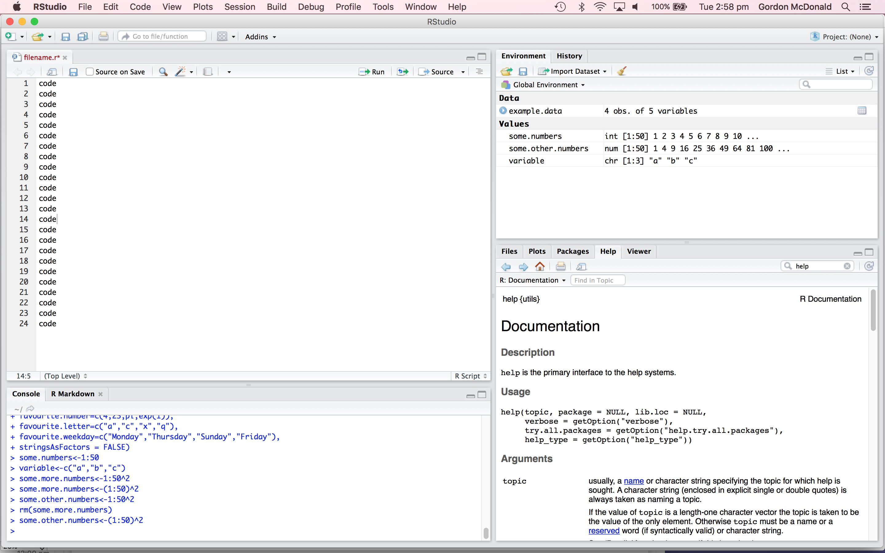

```{r setup, include=FALSE}
knitr::opts_chunk$set(echo = TRUE,
                      cache = FALSE)
```

## Introduction

Welcome to the home page for the Brain & Mind Centre R course. It is a three day course covering six seperate topics that occur frequently to anyone doing pragmatic data analysis. The content is structured in such a way that the material in a section is independent to the other sections, so if you can only make part of the course this won't impact your learning.

These courses are designed to be informal and free flowing, so whilst there is some material we have prepared, if you have a question then at anytime please let us know and we will be more than happy to assist. If there is anything that we can't answer on the day, we will note it down and make sure that we get back to you with a thorough solution.

## About R

### The R Programming Language

[R](https://www.r-project.org/) is an open source programming language and software environment for statistical computing and graphics that is supported by the R Foundation for Statistical Computing. Today, it is one of the most popular languages, being used all across the world in a wide variety of domains and fields.

### RStudio

[RStudio](https://www.rstudio.com/) is an integrated development environment (IDE) for R. It includes a console, syntax-highlighting editor that supports direct code execution, as well as tools for plotting, history, debugging and workspace management.



### Installation & Setup

Below is a script that installs packages that you will need for the next three days and also sets some options which will make the course run smoothly. We will explain what the script does as we get further into the material, but for the meantime we would ask that you copy the script and run it in your environment.

```{r installation, eval=FALSE, message=FALSE}
LoadPackages <- function(x){ for( i in x ){ if( ! require( i , character.only = TRUE ) ){
  install.packages( i , dependencies = TRUE , repos = "http://cran.us.r-project.org")
  require( i , character.only = TRUE )}}}

#  Then try/install packages...
LoadPackages(c("tidyverse",
               "xlsx",
               "ggplot2",
               "foreign",
               "dplyr"))

#options(max.print = 100)

options(scipen = 999)
set.seed(5)
```


## Getting Started

### Calculating things in R

Standard math functions work in R:
```{r}
2+3

1e5-5e4

1/1000

sqrt(2)

2*pi
```

Let's use vectors:

```{r}
1:10

2*(1:10)

2^(1:10)
```

We can store values:

```{r}
x<-3
x=3
3->x
x
x^2
```

### Vectors

We can store vectors:

```{r}
x<-1:10
x
2^x

y<-c(3,4,5)
y^2

some.fruits<-c("apple","orange","banana")
some.fruits
```

### Working with Simple Data

A lot of the time in R we are working with tables of data, know as "data frames". 

Commonly, 

**rows** may represent instances e.g. *data points*, *people*, *events*, etc. while 

**columns** will represent different types of data associated with each data point or instance e.g. *Name*, *ID*, *location*, *time*, *value*...

Here is an example data frame

```{r}
simple.data<-data.frame(first.name=c("Alice",
                                     "Bob",
                                     "Cathy",
                                     "Daniel"),
                        gender=as.factor(c("Female",
                                           "Male",
                                           "Female",
                                           "Male")),
                        favourite.number=c(4,23,pi,exp(1)),
                        favourite.letter=c("a","c","x","q"),
                        favourite.weekday=c("Monday","Thursday","Sunday","Friday"),
                        stringsAsFactors = FALSE)
```

### Viewing The Data
Use the function `View()` to visually look at the data

```{r eval=FALSE}
View(simple.data)
```

How many rows do we have?
```{r}
nrow(simple.data)
```
How many columns do we have?
```{r}
ncol(simple.data)
```


### Accessing Subsets
Return only the first 3 rows of the data set
```{r}
simple.data[1:3,]
simple.data[c(1,2,3),]
simple.data[c(TRUE,TRUE,TRUE,FALSE),]
head(simple.data,3)
```
Return the last two rows in a data set
```{r}
simple.data[nrow(simple.data)+(-1:0),]
tail(simple.data,2)
simple.data[c(FALSE,FALSE,TRUE,TRUE),]
```
Return a random two rows from the data set
```{r}

dplyr::sample_n(simple.data,2)
```


Return only the "favourite.letter" column in the data set
```{r}
simple.data[,4]
simple.data[,"favourite.letter"]
simple.data[,c("favourite.letter")]
simple.data[,c(F,F,F,T,F,F,F)]
simple.data[,names(simple.data) %in% c("favourite.letter")]
simple.data$favourite.letter
```

Return only the first 3 rows and columns 2 and 5 of the data set
```{r}
simple.data[1:3, c(2,5)]
```

Return the columns named "first.name" and "favourite.number"
```{r}
simple.data[,c("first.name","favourite.number")]
```

### Filtering the data

Return only the rows (people) which are Female
```{r}
simple.data[simple.data$gender=="Female",]
```
What exactly happened here?

We made a vector of `TRUE/FALSE` statements, for each row in which this condition is true:
```{r}
indexes<-simple.data$gender=="Female"
indexes
```
then we subset rows in which the index is true

```{r}
simple.data[indexes,]
```

What if we want all of the people whose favourite number is larger than 10?

```{r}
simple.data[simple.data$favourite.number>10,]
```
What if we want just the name all of the people whose favourite number is larger than 10?

```{r}
simple.data[simple.data$favourite.number>10,"first.name"]
```
We could have also done

```{r}
simple.data$first.name[simple.data$favourite.number>10]
```

Quiz: 
1. How to extract Alice's favourite number?
2. Daniel's favourite weekday?

## More Realistic Data

The dataset that we will be using today is taken from the Queensland Government website and is [Gaming Machine Data by Local Government Areas](https://data.qld.gov.au/dataset/gaming-machine-data-by-local-government-areas). It has the following variables:

Variable | Definition
-----------------|------------------------------------------------
Month Year | The month and year from which the gambling data is provided.
LGA Region Name | The name of the Local Government Area.
Approved Sites | The number of venues approved to operate electronic gaming machines.
Operational Sites | The number of venues that were operating electronic gaming machines on the last day of the relevant month.
Approved EGMs | The maximum number of electronic gaming machines the venue is approved to operate.
Operational EGMs | The number of electronic gaming machines operating at the venue on the last day of the revelant month.
Metered Win | The amount of money lost by players of eletronic gaming machines.

If you haven't already, the data can be downloaded from the homepage of this course, or alternatively you can click [here](http://data.justice.qld.gov.au/JSD/OLGR/20170817_OLGR_LGA-EGM-data.csv).

### Reading in Data

The first thing to do before we can begin an analysis is loading some data. To do this we can use the below command.

```{r read_data_1}
gambling.data <- read.csv(file = "http://data.justice.qld.gov.au/JSD/OLGR/20170817_OLGR_LGA-EGM-data.csv",
                 header = TRUE,
                 sep = ",",
                 stringsAsFactors = FALSE)
```

Before going any further, let's break down what this command does specifically.

1. It reads the file, which could be 
- a file path e.g. `"~/Documents/MyFolder/datafile.csv"`
- a url like we have here e.g. `"http://www.website.com/subdomain/datafile.csv"`
2. It specifies that the first row in the csv file contains "header" information i.e. column names
3. It specifies that neighbouring columns are separated by a comma ","
4. It says not to convert charachter strings (i.e. text) to something called a factor

How would we find this out if we didn't know already? Look at the help file:
```{r eval=FALSE}
?read.csv
```

Comma Separated Value (.csv) files are usually the standard, simplest format which is compatible with all sort of different software, e.g. R, python, Excel, MATLAB, ...

But if we needed to read in a different format of data, there's usually a function or a library for doing just that,

e.g.
in base R:

- `read.csv()`
- `read.table()`

In the package "xlsx":

- `read.xlsx()`

In the package "foreign":

- `read.dta()` for STATA (version 5-12) data files 
- `read.spss()` for SPSS files

How can we examine this data set now that we've loaded it?


### Viewing The Data
Use the function `View()` to visually look at the data

```{r eval=FALSE}
View(gambling.data)
```

### Changing The Column Names
Using the background information on the dataset, change the column names so they make sense.


```{r changeNames}
names(gambling.data)

names(gambling.data)[2] <- "Local.Govt.Area"

names(gambling.data)[7] <- "Player.Money.Lost"
```

Afterwards, view the data again to check the column names have been changed.

```{r eval=FALSE}
View(gambling.data)
```

### Add a new Date column
Time to add in a column which has the date as a date-time object instead of as a character string. We will need to use several functions to do this. 

The first function we will need is `paste0()`. This function concatenates strings. For example;
```{r}
paste0("Wo","rd")
```

The second function we will need is `strptime()`

Use the help function to find out what it does: `?strptime`

Now let's convert the character string which we have describing the month and year of each row of data, into a date-time object so that it will be ordered appropriately etc.

```{r}
#Add a day of month (1st) to each date string
date.string <- paste0( "1 " , gambling.data$Month.Year )

#Convert to POSIXlt, a date-time format
strptime( date.string , format = "%d %B %Y" ) -> gambling.data$Date
```

Afterwards, view the data again to check the new "Date" column.

```{r eval=FALSE}
View(gambling.data)
```

### Accessing Subsets
Let's look at all the records for Brisbane:
```{r}
brisbane.only<-gambling.data[gambling.data$Local.Govt.Area=="BRISBANE",]
```

What is the average amount of money lost by players in any given month in Brisbane?
```{r}
mean(brisbane.only$Player.Money.Lost)
```
That's a lot of money!

What is the largest amount of money lost by players in any given month in Brisbane?
```{r}
max(brisbane.only$Player.Money.Lost)
```

What month was this?
```{r}
brisbane.only$Month.Year[which.max(brisbane.only$Player.Money.Lost)]
```


What if we want the rows from brisbane which happen in 2010?
```{r}
row.indicies<-(brisbane.only$Date>="2010-01-01 AEST" &
                 brisbane.only$Date<="2010-12-31 AEST")

(brisbane.2010.data<-brisbane.only[row.indicies,])

```

On the last line we used a shortcut; if you want to assign a variable with `<-` but also print it, you can put the whole expression in parentheses.

### Summarising The Data
Use the summary function to return a quick summary

```{r}
summary(gambling.data)
summary(brisbane.only)
summary(brisbane.2010.data)
```

Use the summary function to return a quick summary of only the money column

```{r}
summary(brisbane.2010.data$Player.Money.Lost)
```

Get a random selection of data and look at which Local government areas are included

```{r}
random.fifty.rows<-dplyr::sample_n(gambling.data,50)

#look at each row's Local Government Area (LGA)
random.fifty.rows$Local.Govt.Area

#look at the unique local government areas (duplicates removed)
unique(random.fifty.rows$Local.Govt.Area)

#look at how many rows there are for each LGA
table(random.fifty.rows$Local.Govt.Area)
```

Challenge: find which Local government area had the lowest non-zero amount of money lost in a month.

## Data Types

There are several different types of data you can use in R, and you can even make your own new *types* (but we won't touch on that today). Now we will examine a few common ones in a little more detail.

### Strings

Character strings are known as "character" in R:

```{r}
gambling.data$Local.Govt.Area[3]

class(gambling.data$Local.Govt.Area)
```

### Numbers

Numbers have different classes, they can be integer:

```{r}
gambling.data$Operational.EGMs[36]

class(gambling.data$Operational.EGMs)
```

They can be numeric:

```{r}
gambling.data$Player.Money.Lost[84]

class(gambling.data$Player.Money.Lost)

class(0.1)

class(pi)
```
They can be complex:

```{r}
class(1i+3)
```

They can be double:

```{r}
x<-as.double(3.345678987654323456789)
```

They can have rounding errors
```{r}
x-(x-0.0000000000001)
```

### Logical (True/False)

```{r}
class(TRUE)
class(1==1)
```

### Factor

A factor is a string label on top of an integer index

```{r}
as.factor("I am a label")
```

This makes most sense in the context of a survey response, e.g. 1=Good, 2, 3=Average, 4, 5=Bad; or something like that. For example in the simple data we had at the beginning, gender is a factor.

```{r}
class(simple.data$gender)
simple.data$gender
as.numeric(simple.data$gender)
table(simple.data$gender)
```


### Vectors and Lists
Vectors are all of the same class


```{r}
#a vector
c("a","b","c")

#another vector
c(1,4,7)
```

If you try to put different classes of things into a vector it will try to convert them to the same class.

```{r}
#this will be converted to a vector of character strings
(what.am.I<-c("a",2,"c",FALSE,c(1,2,3)))
class(what.am.I)
```

Lists can contain different classes of things in each element, possibly of different lengths
```{r}
#a list
list("a",2,"c",FALSE,c(1,2,3))
```

### Data frames

Data frames are really a list of vectors of equal length, and they function like a table of data. We made one right at the beginning:

```{r eval=FALSE}
simple.data<-data.frame(first.name=c("Alice",
                                     "Bob",
                                     "Cathy",
                                     "Daniel"),
                        gender=as.factor(c("Female",
                                           "Male",
                                           "Female",
                                           "Male")),
                        favourite.number=c(4,23,pi,exp(1)),
                        favourite.letter=c("a","c","x","q"),
                        favourite.weekday=c("Monday","Thursday","Sunday","Friday"),
                        stringsAsFactors = FALSE)
```

- We made a column called "first.name", a vector of character strings (favourite.letter and favourite.weekday are also character strings)

- We made a column called "gender", a vector of factors

- We made a column called "favourite.number", a vector of class numeric

- Lastly we told it to not convert all the character string colums into factors (which is something it does by default) by adding the optional argument `stringsAsFactors = FALSE` to the `data.frame()` function.

### Adding records
Add a new row to the data set using the rbind() function:

```{r eval=FALSE}
new.person <- data.frame(first.name="Evelyn",
                        gender="Female",
                        favourite.number=12,
                        favourite.letter="z",
                        favourite.weekday="Monday",
                        stringsAsFactors = FALSE)

simple.data<-rbind(simple.data,new.person)

```


## Writing Data
Use the write.table() function to make the datafile a text file

```{r}
write.table(x = simple.data,
            file = "simpleData.txt",
            row.names = FALSE,
            col.names = TRUE,
            sep = ",")
```

Use the write.csv() function to make the datafile a csv (comma separated values) file

```{r}
write.csv(x = simple.data,
          file = "simpleData.csv",
          row.names = FALSE)
```

          
Use the write.xlsx